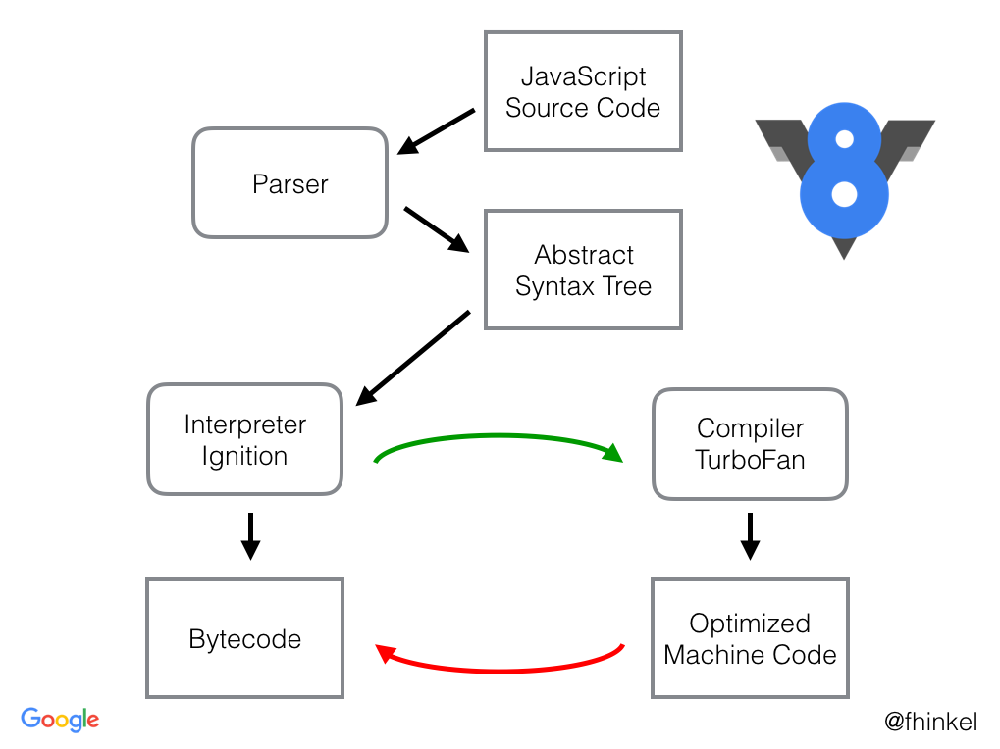

# 🔧 V8 JavaScript Engine – Architecture & Internals

**V8** is Google’s open-source **JavaScript and WebAssembly engine**, written in **C++**. It powers:

- 🧭 Google Chrome
- 🟦 Node.js
- 🦕 Deno
- 🖥️ Electron apps
- ⚙️ Many other JavaScript runtimes

---

## 🧠 V8 Architecture Overview

```text
┌─────────────────────────────────────────┐
│              JavaScript                 │
└─────────────────┬───────────────────────┘
                  │
┌─────────────────▼───────────────────────┐
│           Parser & Compiler             │
│  • Parser                               │
│  • Ignition (Interpreter)               │
│  • TurboFan (Optimizing Compiler)       │
└─────────────────┬───────────────────────┘
                  │
┌─────────────────▼───────────────────────┐
│              Runtime                    │
│  • Heap Management                      │
│  • Garbage Collector                    │
│  • Built-in Functions                   │
└─────────────────┬───────────────────────┘
                  │
┌─────────────────▼───────────────────────┐
│            Machine Code                 │
└─────────────────────────────────────────┘
```

> 

---

## 1️⃣ Parsing Phase

### 🧩 (i) Lexical Analysis (Tokenization)

- The **Scanner/Lexer** breaks code into **tokens**.
- A **token** is the smallest individual unit (e.g. keywords, identifiers, operators).

Example:

```js
let a = 90;
```

Tokens: `"let"`, `"a"`, `"="`, `"90"`, `";"`

---

### 🧱 (ii) Syntax Analysis (Parsing)

- A **Parser** builds an **Abstract Syntax Tree (AST)** using tokens.
- You can visualize an AST here: [AST Explorer](https://astexplorer.net/)

---

## 2️⃣ Interpretation Phase

### 🎛 Ignition Interpreter

- Converts JS code to **Bytecode**.
- Bytecode is ready for **execution by V8 runtime**.

---

## 3️⃣ Optimization Phase

### 🚀 TurboFan Optimizing Compiler

- Identifies **hot code** (frequently executed functions or blocks).
- Optimizes the code and compiles it to **highly efficient machine code**.

Example of "hot code" optimization:

```js
// Hot function that gets optimized
function add(a, b) {
  return a + b;
}

// Called many times → TurboFan kicks in
for (let i = 0; i < 100000; i++) {
  add(i, i + 1);
}
```

## Deoptimization in V8 (xTraaaa)

-> V8 also has a sophisticated deoptimization system that kicks in when its assumptions are proven wrong
-> Deoptimization is the process where V8 downgrades optimized code back to interpreted bytecode when its assumptions about the code's behavior are violated.

How It Works :

```js
// Initially, V8 assumes numbers based on early calls
function add(a, b) {
  return a + b;
}

// TurboFan optimizes for numbers
add(5, 10); // Numbers - optimization kicks in
add(15, 25); // Numbers - stays optimized
add(30, 40); // Numbers - stays optimized

// DEOPTIMIZATION TRIGGERED HERE!
add("hello", "world"); // Strings - assumptions broken!
```

-> what happened here is, intially i was passing numbers while calling add(), so turbofan compiler made an assumption that, only Numbers can be passed to add() function, so optimized it
-> but, when i passed two strings instead of numbers, 'de-optimization' triggered there
-> Deoptimization is expensive - both immediate and long-term costs

---

> 

---

## 📌 Summary

| Phase                | Engine/Component | Purpose                           |
| -------------------- | ---------------- | --------------------------------- |
| **Lexical Analysis** | Scanner          | Breaks code into tokens           |
| **Syntax Analysis**  | Parser           | Builds the AST                    |
| **Interpretation**   | Ignition         | Converts code to bytecode         |
| **Optimization**     | TurboFan         | Compiles hot code to machine code |
| **Execution**        | Runtime          | Manages memory, GC, and built-ins |

---

--> The whole above process of interpretation & compilation is known as JIT(just in time) Compilation

## 4️⃣ Memory Management

**_ Heap Structur _**

```text
┌─────────────────────────────────────┐
│              New Space              │
│  (Young Generation)                 │
│  • Nursery (newly allocated)        │
│  • Intermediate                     │
├─────────────────────────────────────┤
│              Old Space              │
│  (Old Generation)                   │
│  • Large Object Space               │
│  • Map Space                        │
│  • Code Space                       │
└─────────────────────────────────────┘
```

## 5️⃣ Garbage Collection

### some garbage collectors :- orinoco, oilpan, scavenger etc...

V8 uses a generational garbage collector:

**_ Scavenger (Minor GC) _**

- Collects new space
- Uses Cheney's algorithm (semi-space copying)
- Very fast - typically < 1ms

**_ Mark-Sweep-Compact (Major GC) _**

- Collects old space
- Mark phase: finds reachable objects
- Sweep phase: reclaims unreachable objects
- Compact phase: reduces fragmentation

```js
// Example of object promotion
let obj = {}; // Allocated in new space

// After surviving several minor GCs
// Object gets promoted to old space
setTimeout(() => {
  console.log(obj); // Still referenced, so survives GC
}, 1000);
```

> ✨ Understanding V8 internals helps to write performant JS code and debug runtime behavior effectively.
